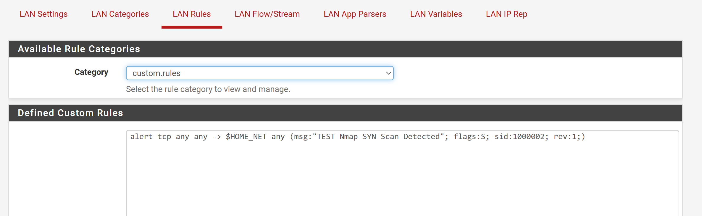
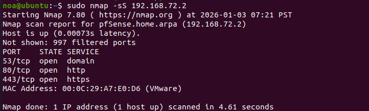
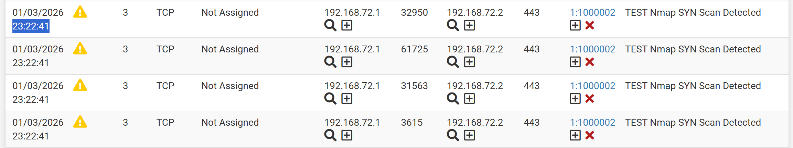
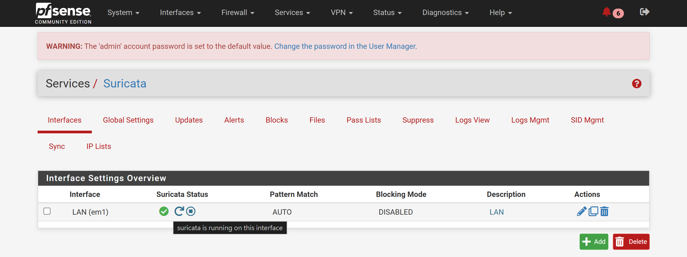
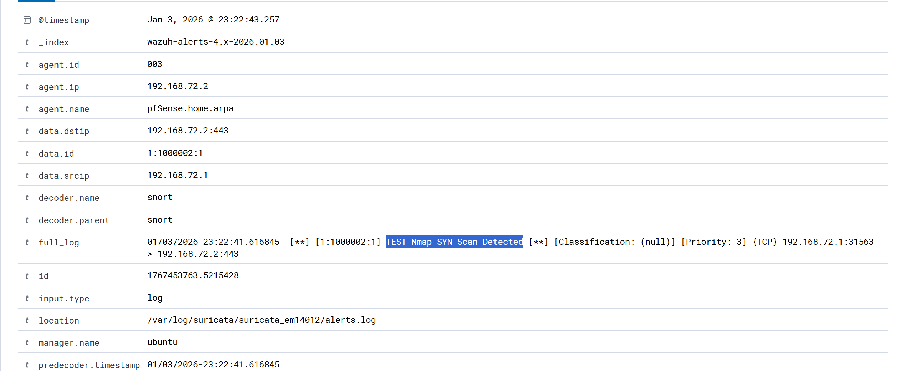
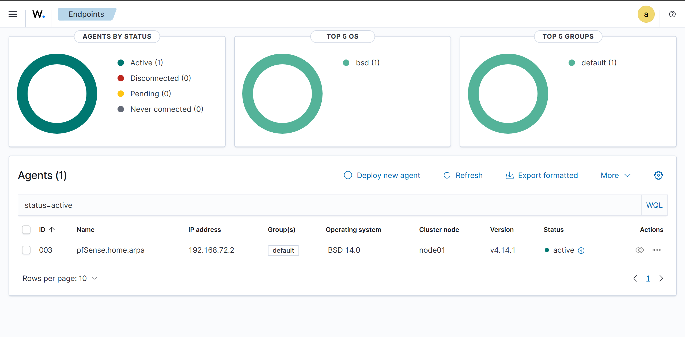

pfSense + Suricata + Wazuh 整合實作（期末作業）

一、作業說明

本作業選擇題目二，實作 pfSense 與 Wazuh 的整合，透過在 pfSense 上部署 Suricata 作為入侵偵測系統（IDS），並使用 Wazuh agent 將偵測到的事件傳送至 Wazuh Server 進行集中式分析與監控。
本實驗目標為驗證 pfSense 所產生的安全事件，是否能成功被 Wazuh 接收、解析並顯示於 Dashboard 上。

二、實驗環境

系統架構與 IP 配置

防火牆 / IDS	pfSense + Suricata + Wazuh-agent	192.168.72.2

SIEM Server	Wazuh Server (Ubuntu)	192.168.72.130

攻擊模擬主機	Ubuntu VM (Nmap)	192.168.72.140

三、系統架構說明

本實驗中，所有內網流量皆經由 pfSense 進行轉送。
Suricata 部署於 pfSense 的 LAN 介面上，負責即時監控與偵測可疑網路行為。
當 Suricata 偵測到掃描或異常流量時，會將事件記錄於日誌中，並由 pfSense 上的 Wazuh agent 讀取後傳送至 Wazuh Server。
Wazuh Server 會對事件進行解析與集中顯示，提供統一的安全事件監控介面。

四、攻擊模擬方式

為驗證系統偵測能力，本實驗使用 Nmap 進行 SYN 掃描，模擬常見的網路掃描行為。

sudo nmap -sS 192.168.72.2

此掃描行為會觸發 Suricata 的 Port Scan 相關規則，用以測試 IDS 與 SIEM 的整合效果。

五、實作結果與畫面說明

（一）自訂 Suricata 規則（Custom Rule）

本實驗於 pfSense 的 Suricata 中建立自訂規則，用以偵測 TCP SYN Scan 行為。  
當來源主機對內部網路進行 SYN 封包掃描時，Suricata 會觸發警示，並將事件記錄至日誌中。

📸 對應截圖：

（二）Nmap 掃描行為

使用 Nmap 從 192.168.72.140 對 pfSense (192.168.72.2) 進行 SYN 掃描，成功模擬掃描攻擊行為。

📸 對應截圖：

（三）Suricata 偵測結果（pfSense）

Suricata 成功偵測到多筆 Nmap SYN Scan 行為，顯示來源 IP、目的 IP 及對應 Port，證明 IDS 正常運作。

📸 對應截圖：

（四）Suricata 服務啟用狀態

Suricata 已成功啟用於 pfSense 的 LAN 介面，並處於 Running 狀態，確認 IDS 為即時運作中。

📸 對應截圖：

（五）Wazuh Security Events（集中分析）

Wazuh Dashboard 成功接收到來自 pfSense 的 Suricata 事件，並解析出掃描行為相關資訊（如 signature、來源與目的 IP），證明 IDS 與 SIEM 整合成功。

📸 對應截圖：

（六）Wazuh Agent 狀態

pfSense 上的 Wazuh agent 顯示為 Active 狀態，代表系統連線正常，事件可持續傳送至 Wazuh Server。

📸 對應截圖：

六、技術困難排查與解決

在實作整合過程中，遭遇了數個技術瓶頸，經由查看日誌（Logs）與除錯分析後順利解決，整理如下：

1. Wazuh Agent 無法連線至 Server (Protocol Mismatch)
遭遇問題： 在 pfSense 安裝好 Agent 後，Dashboard 始終顯示 "Disconnected"。檢查 /var/ossec/logs/ossec.log 發現大量 Closing connection to server ([IP]:1514/udp) 的錯誤訊息。

原因分析： Wazuh Agent 預設或舊版設定檔可能使用 UDP 協定進行傳輸，但 Wazuh v4 架構預設採用 TCP 協定以確保資料傳輸的可靠性，導致通訊協定不匹配而無法建立連線。

解決方案： 修改 pfSense 上的設定檔 /var/ossec/etc/ossec.conf，將 <server>區塊中的 <protocol> 標籤強制改為 tcp，重啟服務後即成功連線。

📸 對應截圖：

2. Suricata 日誌無法傳送至 Wazuh (Log Path Issue)
   
遭遇問題： Suricata 已成功偵測到 Nmap 掃描並產生 eve.json，但 Wazuh Dashboard 卻收不到任何相關事件。

原因分析： pfSense 的 Suricata 套件會根據介面名稱動態建立日誌資料夾（例如 /var/log/suricata/suricata_em1_59381/），而非固定的 /var/log/suricata/。Wazuh Agent 設定檔中若使用預設路徑，將導致 Agent 讀取不到檔案。

解決方案： 使用 find 指令確認真實日誌路徑，並修正 ossec.conf 中的 <localfile> 設定，指定到精確的 eve.json 位置。

📸 對應截圖：

七、進階防禦機制探討：自動化阻擋

本實驗主要驗證了「偵測（Detection）」與「監控（Monitoring）」的有效性。若要進一步達成作業要求中的「回應與阻擋（Response/Blocking）」，可透過 Wazuh 的 Active Response 機制來實現自動化防禦。其實作邏輯與架構規劃如下：

運作原理：

當 Wazuh Server 接收到 Suricata 傳來的事件（如 Nmap 掃描），且該事件觸發了特定等級（Level）的警報或符合特定規則 ID（Rule ID）。

Wazuh Server 會即時發送指令給 pfSense 上的 Wazuh Agent。

Agent 接收指令後，執行預先寫好的腳本（Script），呼叫 pfSense 底層的防火牆指令（pfctl）將攻擊來源 IP 加入黑名單（Blacklist Table），從而阻斷連線。

配置規劃：

Wazuh Manager 端 (ossec.conf)：需定義 <command>（指定要執行的腳本名稱，如 firewall-drop）以及 <active-response> 區塊（設定觸發條件，例如：當警報等級 >= 7 時觸發）。

pfSense Agent 端：需確認 /var/ossec/active-response/bin/ 目錄下具有對應 FreeBSD 系統的防火牆腳本，並具有執行權限。

預期效益： 透過此機制，系統將從被動的「入侵偵測（IDS）」升級為自動化的「入侵防禦（IPS）」，能有效縮短從發現攻擊到阻擋攻擊的時間差（Time-to-Mitigate）。

八、結論

本實驗成功完成 pfSense IDS 與 Wazuh SIEM 的整合，並驗證掃描攻擊事件可被即時偵測、記錄與集中分析。
